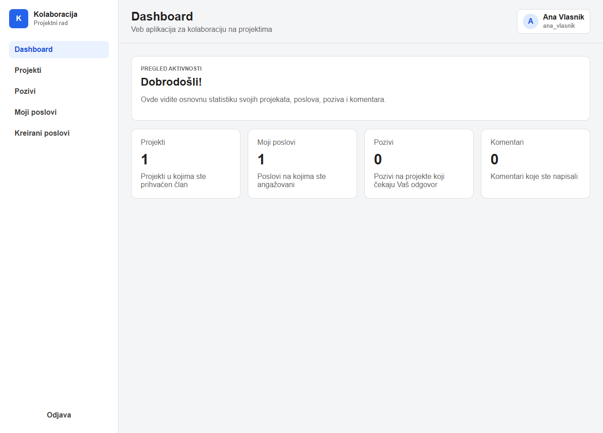
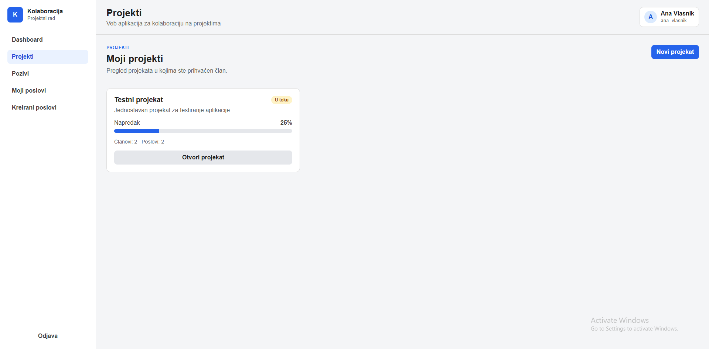
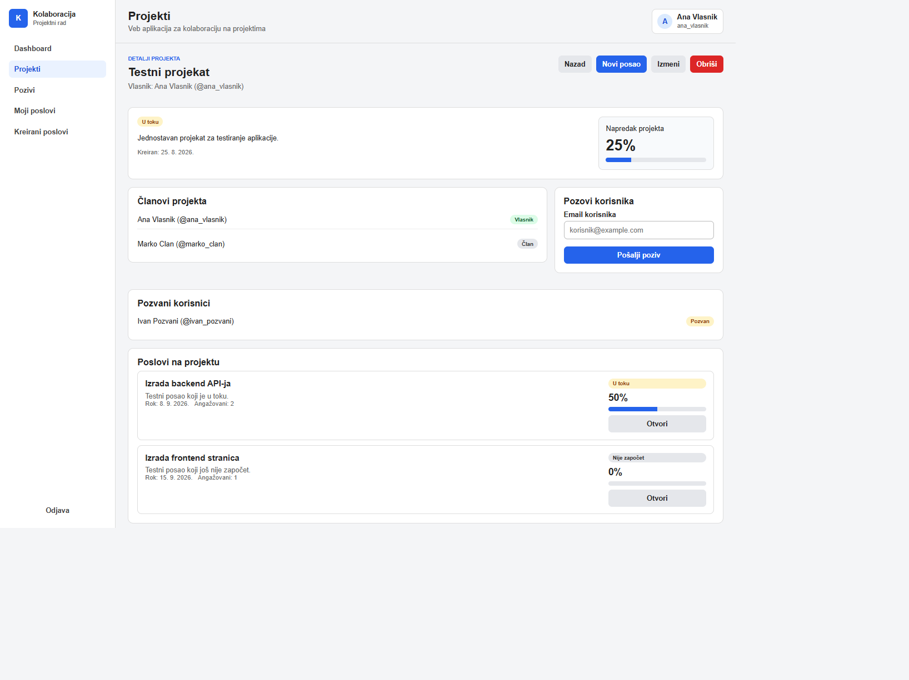
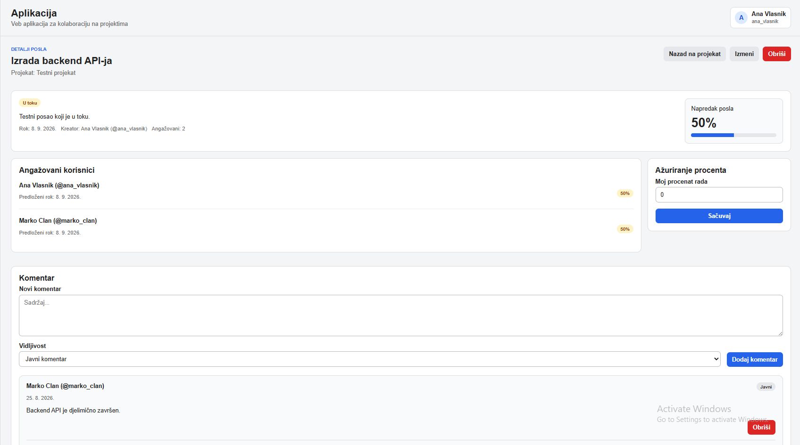
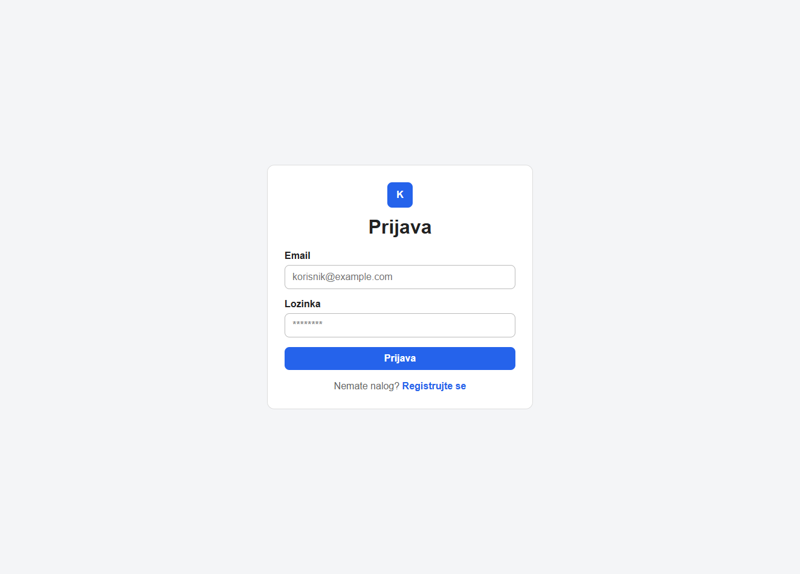
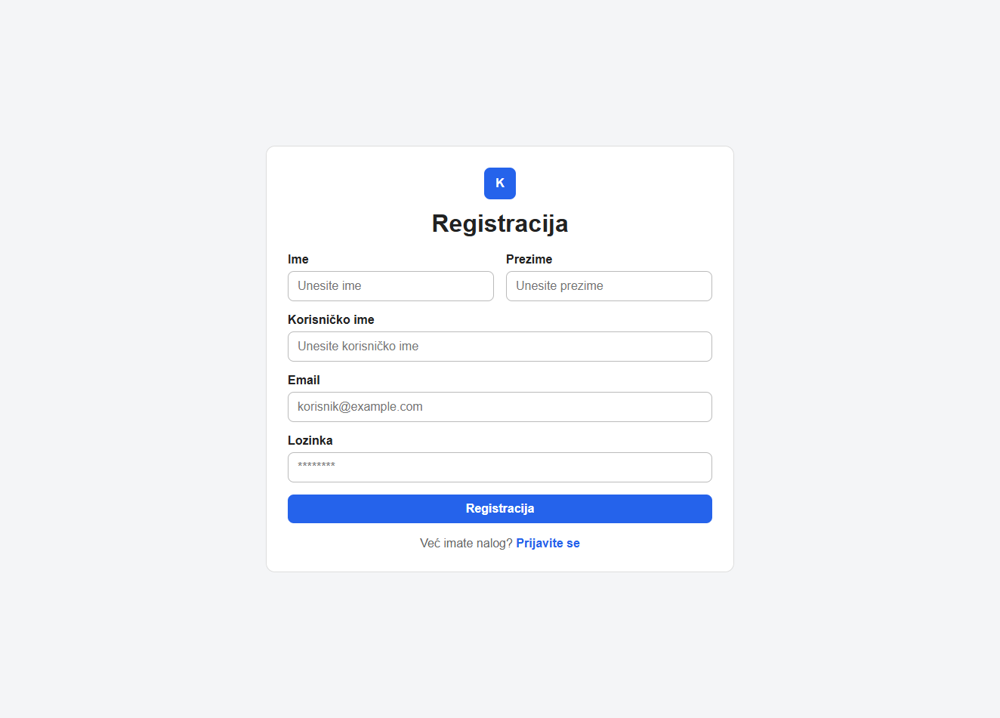

# Project Collaboration Platform

A full-stack web application developed as my individual bachelor's thesis in Software and Information Engineering.

The application is designed to support collaboration on projects by allowing users to create projects, invite members, create and manage tasks, track task progress, communicate through comments, and share file or link attachments.

## Features

- User registration and login
- JWT-based authentication
- Project creation and management
- Project member invitations and invitation responses
- Task creation and management
- Individual task progress tracking
- Project and task progress overview
- Public and private task comments
- File and link attachments
- User dashboard with relevant project and task information

## Screenshots

### Dashboard

An at-a-glance summary of the user's projects, assigned tasks, invitations, and comments.



### Projects overview

Projects are presented with their current status, progress, team size, and task count.



### Project details

Members, pending invitations, tasks, and overall project progress are managed from one view.



### Task collaboration

Assigned members can track individual progress and communicate through task comments.



### Authentication

<table>
  <tr>
    <th>Login</th>
    <th>Registration</th>
  </tr>
  <tr>
    <td>Existing users can securely access their workspace.</td>
    <td>New users can create an account from a simple registration form.</td>
  </tr>
  <tr>
    <td></td>
    <td></td>
  </tr>
</table>

## Tech Stack

| Area | Technologies |
| --- | --- |
| Frontend | React, TypeScript, React Router, Axios |
| Backend | Node.js, Express, TypeScript |
| Database | MySQL |
| Authentication | JWT, bcrypt |
| Validation | Zod |
| File Uploads | Multer |
| Development | Git, npm, Vite |

## Architecture

The application is divided into a React frontend, an Express REST API, and a MySQL relational database.

The backend follows a layered structure:

- **Routes** define API endpoints.
- **Controllers** handle HTTP requests and responses.
- **Services** contain application and database logic.
- **Validators** validate incoming data.
- **DTOs** define structured data returned by the API.
- **Middlewares** handle authentication and application errors.

The frontend separates pages, reusable components, API communication, authentication state, routing, and shared types.

## Database

The relational database models users, projects, project memberships, tasks, task assignments, comments, and attachments.


## Project Structure

```text
.
├── backend
│   ├── database
│   └── src
│       ├── config
│       ├── controllers
│       ├── dto
│       ├── middlewares
│       ├── routes
│       ├── services
│       ├── utils
│       └── validators
├── docs
└── frontend
    └── src
        ├── api
        ├── components
        ├── context
        ├── pages
        ├── routes
        ├── types
        └── utils
```

## Getting Started

### Requirements

- Node.js 20.19 or newer
- MySQL 8
- npm

### Database

Start MySQL and execute:

```text
backend/database/schema.sql
```

Optional test data can be loaded using:

```text
backend/database/test_podaci.sql
```

> The test data script removes existing table data before inserting the provided sample data.

### Backend

Inside the `backend` directory, copy `.env.example` to a new file named `.env`, configure your MySQL credentials, and replace the `JWT_SECRET` placeholder with your own random secret of at least 32 characters.

Then run:

```bash
cd backend
npm install
npm run dev
```

With the provided `.env.example` configuration, the backend is available at:

```text
http://localhost:3000
```

### Frontend

In another terminal, run:

```bash
cd frontend
npm install
npm run dev
```

The frontend is available at:

```text
http://localhost:5173
```

## Test Accounts

All provided test users use the password:

```text
Test123!
```

| Email | Role |
| --- | --- |
| ana.vlasnik@example.com | Project owner |
| marko.clan@example.com | Project member |
| ivan.pozvan@example.com | Invited user |

## Academic Context

This project was developed individually as a bachelor's thesis project.

The main goal was to design and implement a complete full-stack application, including a relational database, REST API, authentication, validation, frontend application, and file handling.
